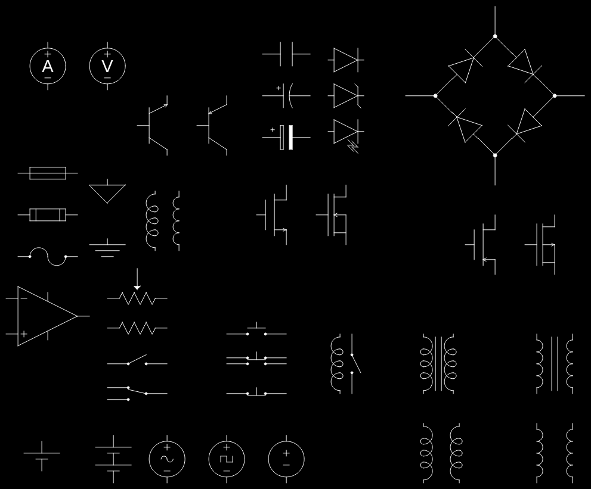

# [DXF-ElectronicComponentsLibrary](https://github.com/Bollos00/DXF-ElectronicComponentsLibrary)

This is a new -- work in progress -- Electronic and Digital Components block library for in the **dxf** format. It is compatible with softwares that support the dxf format, like LibreOffice, Inkscape, LibreCAD and QCAD.
